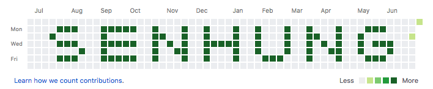

# Greenhub

## Description

Make your Github contribution graph green by adding dump commits and changing committing dates.

## Demo

A demo account is [wsenh](https://github.com/wsenh).

## How to use

1. Download the scripts

```bash
$ git clone https://github.com/senhungwong/greenhub.git
```

2. Put the downloaded files into your repository

3. Run command (see more [Commands](#commands))

## Commands

### Everyday

Commit everyday from a given date til now

```bash
$ python3 green everyday
```

```
Params:

--start_date               (str) : the start date of the commit, default 380 days ago
--commit_times_lower_bound (int) : the everyday commit times lower bound, default 1
--commit_times_upper_bound (int) : the everyday commit times upper bound, default 1
--change_commit_date       (bool): update all the commit date to author date
--push                     (bool): push the commits at the end
--force                    (bool): do a force push if is pushing
```

If you set a lower bound or upper bound, on each date, it will generate a random number between the bounds and commit
that number of times.

### Graph

Commit using a user defined commit graph

```bash
$ python3 green graph
```

```
Params:

--name               (str) : the graph name
--base               (int) : the base number of commit times (except 0 times)
--change_commit_date (bool): update all the commit date to author date
--push               (bool): push the commits at the end
--force              (bool): do a force push if is pushing
```

#### Green Graph Representation

```
.   -> commit 0 times
1-9 -> commit 1-9 times
0   -> commit 10 times
A-Z -> commit 11-36 times
a-z -> commit 37-62 times
```

**Example:**

```
.....................................................
....aaa...aaaaa..a...a..a...a..a...a..a...a...aaa....
...a......a......aa..a..a...a..a...a..aa..a..a.......
....aaa...aaaaa..a.a.a..aaaaa..a...a..a.a.a..a.aaa...
.......a..a......a..aa..a...a..a...a..a..aa..a...a...
....aaa...aaaaa..a...a..a...a...aaa...a...a...aaa....
.....................................................
```


